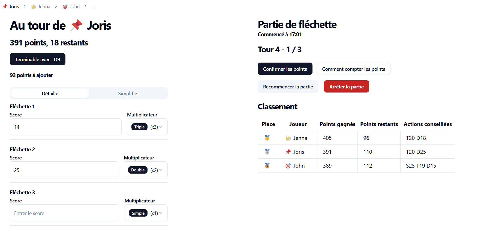

# 🎯 DartScore

This project is a simple lightweight Darts Scoreboard that allows you to keep track of your scores while playing darts.
It also helps the player to calculate the remaining score, and calculate the best possible moves to finish the game.

> The logic is implemented in the `src/DartGame` folder and can be easily extended to support more platforms.



## Technologies

- [Vite](https://vitejs.dev/) for the build tool
- [React](https://reactjs.org/) for the UI
- [TypeScript](https://www.typescriptlang.org/) for the language
- [TailwindCSS](https://tailwindcss.com/) for the styling
- [ShadCn](https://ui.shadcn.com) for the UI design

## Installation

### Docker

The project is dockerized, so you can run it in a container.

> Create the image

```bash
docker build -t dartscore .
```

> Run the image

```bash
docker run -d -p 7001:80 --name client-dartscore dartscore
```

> Update the image

```bash
docker stop client-dartscore
docker rm client-dartscore

docker build -t dartscore .
docker run -d -p 7001:80 --name client-dartscore dartscore
```

### Local

> Install the dependencies

```bash
npm install
```

> Run the project

```bash
npm run dev
```

> Build the project

```bash
npm run build
```

> Serve the project

```bash
npm run preview
```

## License

This project is licensed under the MIT License - see the [LICENSE](LICENSE) file for details.
